Final Report

Build Instructions:
pip install -r requirements.txt

Data Collection:
The initial plan to use SteamDB and Steam API fell short since many endpoints are not available 
to regular users. The ones that are available do not keep track of temporal data, and so I am 
only able to scrape current concurrent player count and current price, not release price. I 
ended up using 2 kaggle datasets and processing them to obtain data I wanted.
https://www.kaggle.com/datasets/whigmalwhim/steam-releases?select=game_data_all.csv
https://www.kaggle.com/datasets/joebeachcapital/top-1000-steam-games

Data Visualization:
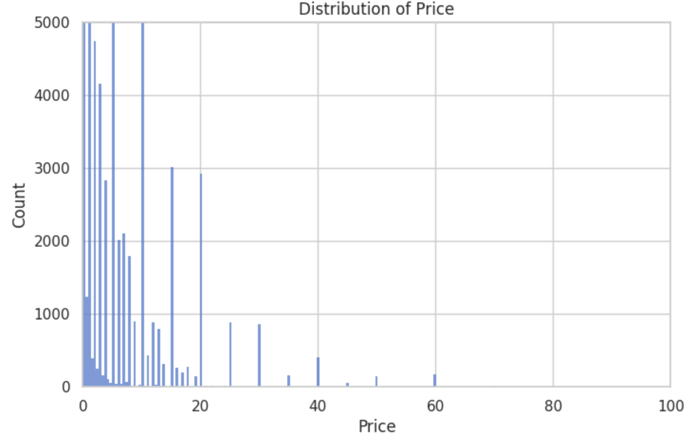
Price has a long tail skew, with lower prices being much more common than higher prices.

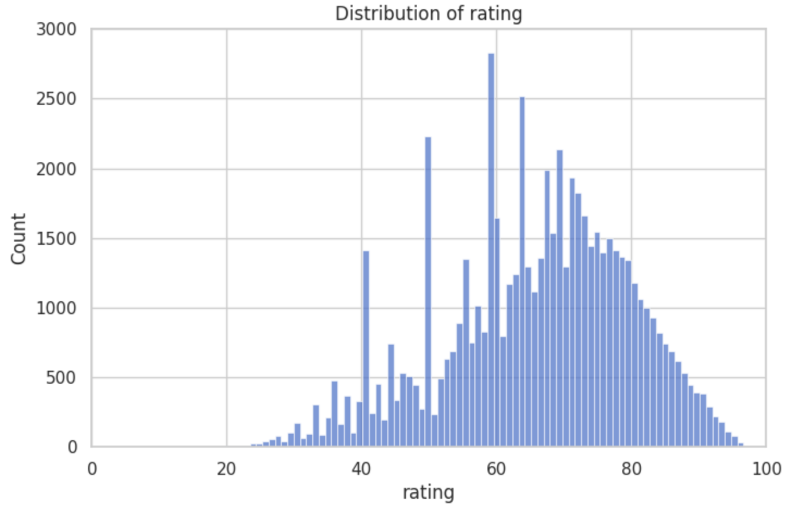
Rating has a traditional bell curve.

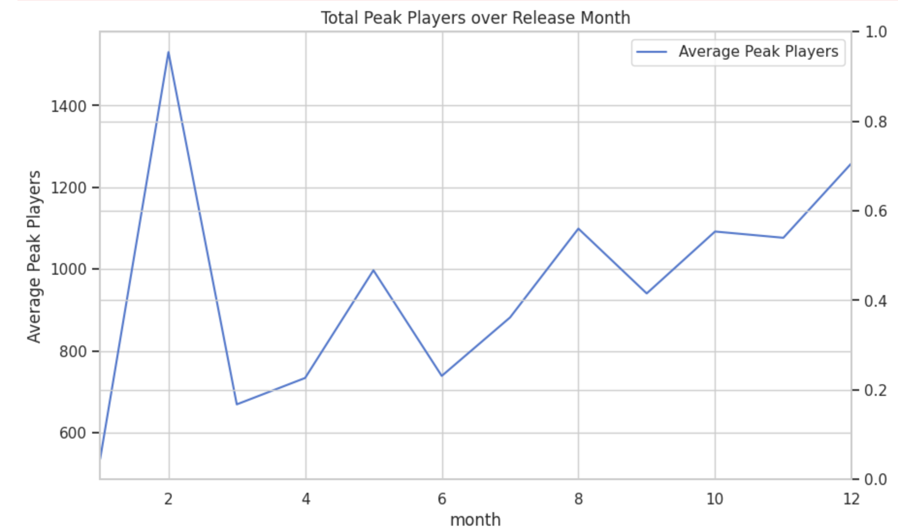
Month has a overall uniform distribution.

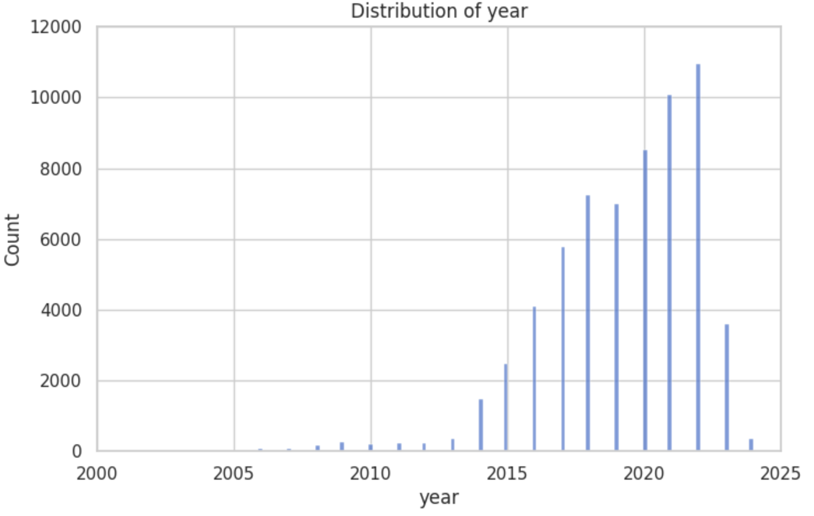
The amount of games per year trends upward with the exception of recent years due to incomplete data.

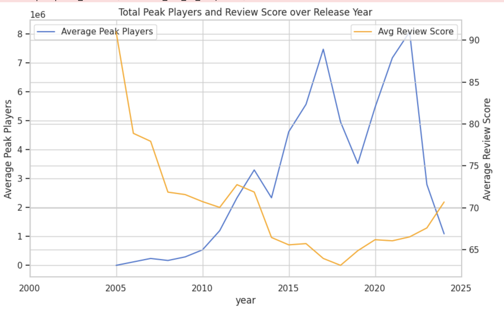
Score trended down and average players trended up for a while showing an increasing market and higher standards,
but in recent years has flattened out a bit.

I feel uncomfortable making any generalizations from this data, likely no information to be gained here.

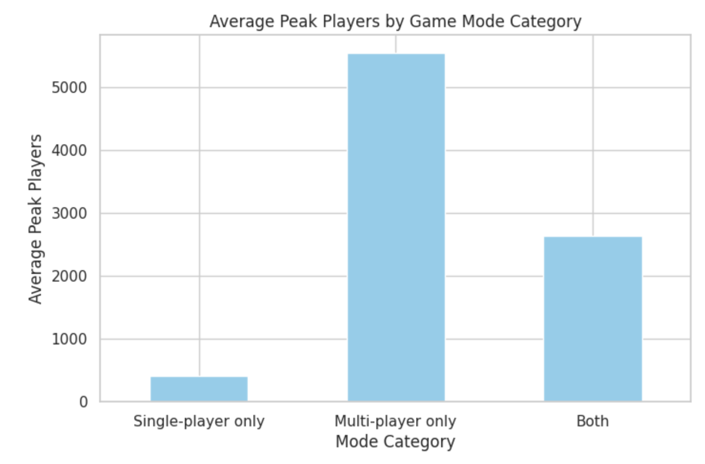
A clear visual showing multi player games tend to have much more players. This could be explained by
in game events or other similar incentives to get players.

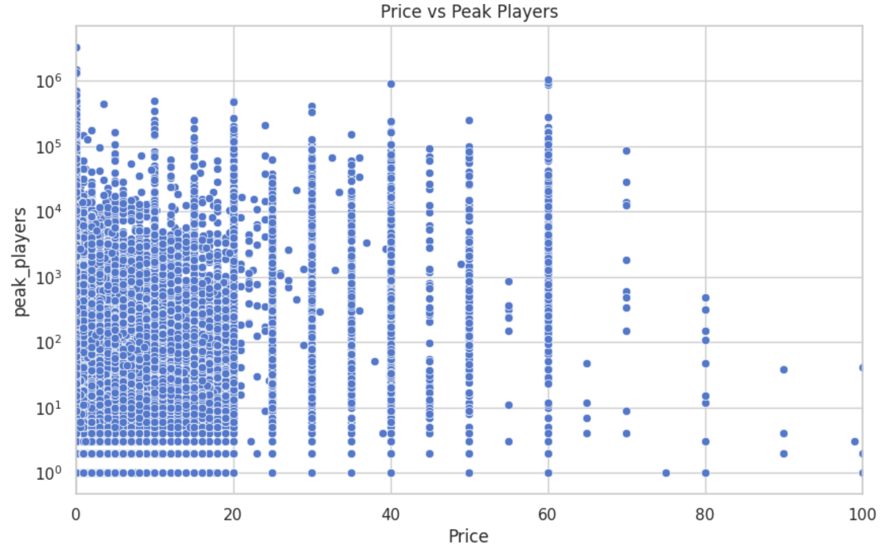
The data is very spread out showing that price is a very saturated point and cannot be a good predictor alone.

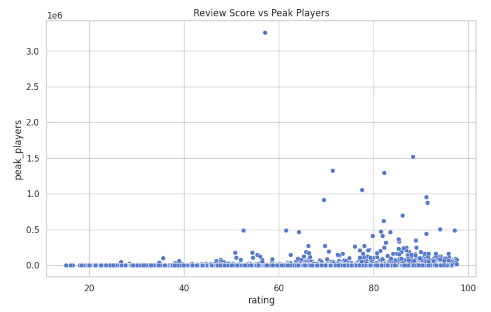
A little more promising graph showing that higher ratings tend towards higher player count. A little obvious
but nice to confirm.

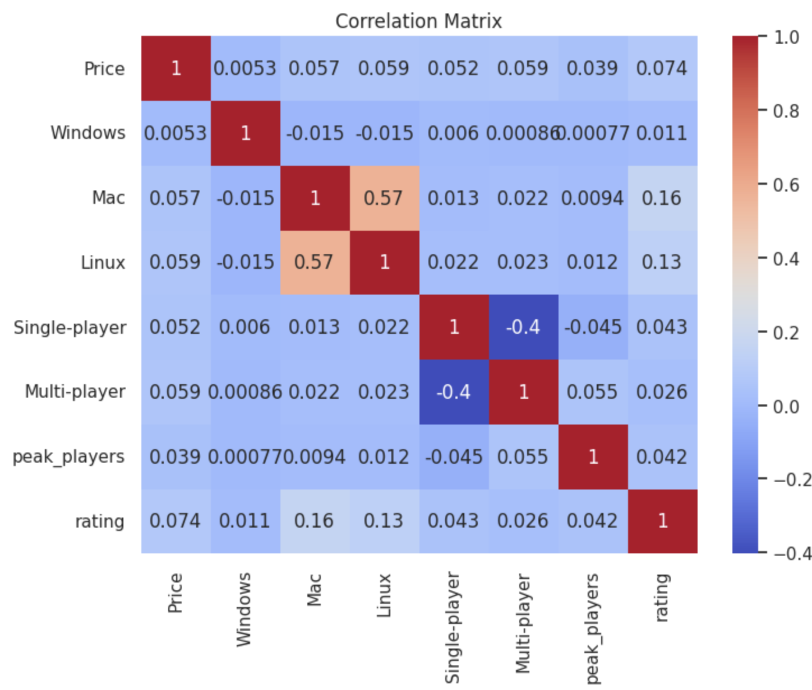
We can see that single player and multi player have a very large effect on the players, with price and rating having
a decent effect as well.

Data Processing:
From the first data set I took peak_players, rating, and primary_genre data, while from the second
I took Release date, Price, and Categories data. I processed the Categories into a one hot encoding
of Single-player and Multi-player. I also processed the Release date into 3 columns for day, month
and year. Finally I joined the two datasets by the steam appid, which I had to process since the 
two datasets keep track of it differently. 
I also one hot encoded the genre, and added platform availability to the data as well.

Model Training:
The initial idea was to predict raw peak players. I first tried using linear regression, but ended up with a
very poor R squared of 0.5 even after log transforming the features. Using random forest did not offer any significant
benefits either. I then pivoted to predicting estimated owners, as this was categorical numerical data and could
prove to be a more reasonable task. However, filtering out the N/A values left me with only around 9k samples, losing
80% of my data. Then I realized I could turn peak players into categorical as well by binning the data.
Now with good data and goal, I used RandomizedSearchCV on an XGBoost learner to train a model.

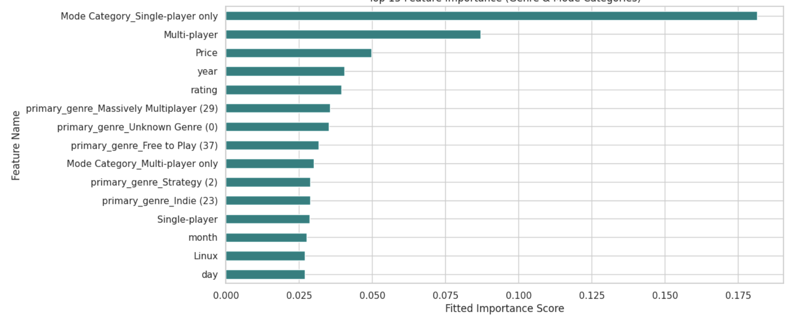

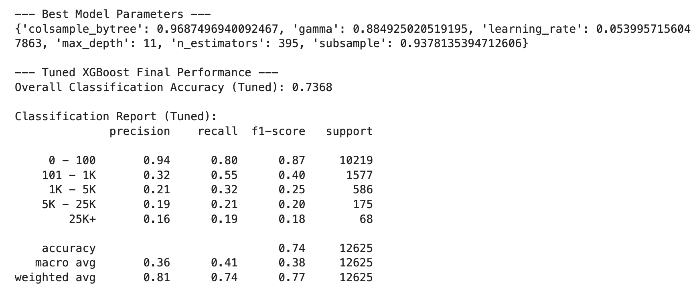
Overall a decent performance with 73% accuracy. Our macro f1 score is 38% which is low, but weighted is 77% which is
not too bad. I think at the end of the day if it was that easy to predict a super successful game based on numerical
stats alone, the industry would've figured that out already. Our model is at least decent at predicting whether or not
a game will get any attention at all.

Notes:
The model1 in the repo is version of the model without platform information (Windos/Mac/Linux). I kept it
because it has slightly better F1 macro performace.

Video:
https://youtu.be/9S-Sq2wuPPE